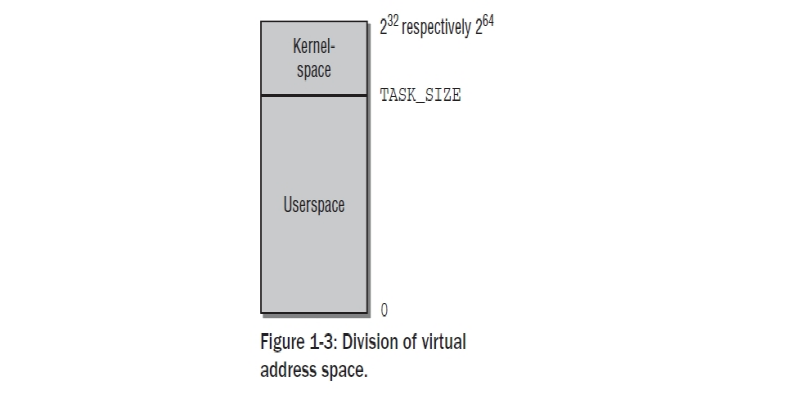
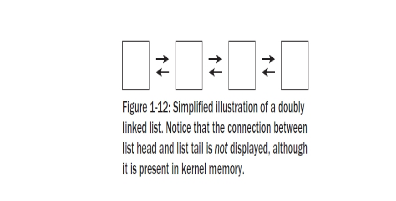

Chapter 1:Introduction and Overview
######################################

본책을 읽기 위해서는 C 프로그래밍에 대한 기본 지식이 있어야 한다. 커널은 C 프로그래밍의
진보된 기술을 사용하고 무엇보다도 C GNU 컴파일러를 사용하기때문이다.
Appendix C에는 훌륭한 프로그래머조차도 친숙하지 않은 파이너 포인터 C를 기술하였다.
컴퓨터 구조들에 대한 기본 지식은 시스템 하드웨어와(특히 CPU) 직접적으로 필수적으로 상호작용을
하는 리눅스로서는 유용하게 될것이다.
그리고 여기에 주제들과 관련된 많은 도입 내용들이 부수적으로 추가되었고, 일부는 참고 섹센에
두었다.
좀더 깊이가 있는 CPU를 다룰때( 대부분 IA-32,AMD64를 다뤘고 이 구조는 리눅스에서 가장 최우선으로
아키텍처로 삼고 있다) 좀더 상세한 관련된 하드웨어를 설명하였다.
일상적인 삶에서 유비쿼터스하지 않은 메카니즘을 설명할때,그 뒤에 숨어 있는 일반적인 개념들을
설명하게 될것이다. 따라서 독자들은 그 특별한 특성들이 유저스페이스로 사용되는지에 대해서는 참고로
읽어야 될것이다.
이 장에서는 커널의 다양한 영역의 모습들과 다음장에서 다루게 될 각 하위시스템의 좀더 심도있는 관찰에 앞서
기본적 관계를 다르게 될것이다.

커널은 빠르게 진화되어왔기때문에 자연스럽게 드는 의문은 어떤 버젼을 이 책에서 다루었느냐이다.
나는 이책에서 2008년 1월에 릴리즈된 커널 2.6.24를 기준으로 다루었다.
커널 발전의 다양한 본성은 앞으로 독자들이 읽을때쯤의 새로운 버젼의 커널을 암시할 것이다.
일정부분은 바뀌게 될것이다. 이것은 회피할 수 없는것이며 이렇게 되지 않았다면 리눅스는 사장되고
지루한 시스템이 될것이다. 어떤 부분은 변한 반면 기본적으로 컨셉들은 변하지 않을것이다.
특히나 커널 2.6.24는 이전 버젼과는 확연히 다르게 기본적인 변화들이 있었다.
개발자들은 이러한 부분들을 너무 많이 성토하지 말길 바란다.

1.1 Task of the Kernel
====================================

순수한 기술적 레벨에서 커널은 하드웨어와 소프트웨어의 중간단계이다.
이것의 목적은 어플리케이션에서의 요청을 하드웨어로 전달하고 시스템의 콤퍼넌트와
드라이버의 번지수를 지정하는 하위레벨 드라이버로서 동작한다.
그럼에도 불구하고 또다른 커널을 보는 재미 있는 점이 있다.

  * 커널은 어플리케이션 관점에서 상위레벨에 있는 컴퓨터를 추상화할 수 있는 진보된 기계로
    간주될 수 있다. 예를 들면 커널이 하드디스크를 주소로 할때 그 명령이 어떤 경로를 통해
    디스크로 보내져야 하는지 데이터가 존재하는곳인 디스크에서 메모리로 데이터를
    복사할수 있는 경로를 결정해야 한다. 반면 어플리케이션은 그 데이터가 전달되야 하는
    명령을 발행할 필요만 있다.
    어떻게 이것이 실행되는지는 어플리케이션과는 상관이 없다.상세한것은 커널에 의해 추상화
    되어진다.어플리케이션 프로그램은 하드웨어 자체과 접촉하지 않는다.그들이 알고 있는
    하이러키에서 가장 낮은 레벨을 표현하는 커널만이 접촉을 한다.
    따라서 진보된 기계라고 말할 수 있다.

  * 리소스 매니저로서 커널을 본다는것은 여러 프로그램들이 시스템내에서 동시에 실행된다는것을
    정당화하는 것이다. 이러한 경우에 커널은 동시간대에 시스템을 통합에 신뢰성을 주면서
    다양한 시스템 프로세서간 CPU 타임,디스크 공간,네트웍 연결등에 대한 가능한
    리소스를 공유하는 인스턴스이다.

  * 커널의 또다른 관점은 일련의 시스템에 관련된 명령어들을 제공하는 라이브러리 관점에서
    본다는 것이다. 일반적으로 알듯이,시스템콜은 컴퓨터에 요청을 보낼때 사용되어 진다.
    스탠다드 C 라이브러리 도움말에 의하면, 이러한 것들은 어플리케이션들은 동일한 방법으로
    생성된 일반적인 함수내지 다른 함수로 나타나게 된다.

1.2 Implementation Strategies
====================================

여기에는  운영시스템의 근간이 되는 두가지 패러다임이 있다.

    - Microkernles
      이것들은 유일한 기본 함수들로서 커널의 중앙부에 구현된다. 모든 다른 함수들은 명확히
      정의된 통신 인터페이스를 통해 중앙부의 커널과 통신하는 자발적인 프로세스들을 대표하게
      된다. 예를 들면 다양한 파일시스템,메모리관리 등이다.( 물론,마이크로 커널안에서 그것
      자체로 시스템과 통신을 컨트롤하는 메모리 관리의 가장 근간이다 어쨋든 시스템콜 레벨을
      다루는것은 외부 서버들에서 구현되어진다.)
      이론적으로 이것은 개별적 부분들이 서로 각각 명확하게 분리되어 있기때문에 매우 우아한
      접근이 된다. 이것은 프로그래머들에게 "클린" 프로그램 기술을 사용하도록 종용하게 된다.
      이러한 접근의 다른 잇점은 다양한 확장성과 러닝타임에 중요한 콤퍼넌트를 스왑할 수 있는
      능력이다.
      그러나 부수적인 CPU 타임을 소유하는것은 컴포턴트들간의 복잡한 통신을 지원할 필요가 있게
      된다.
      마이크로 커널이 현재까지 다양하고 활동적인 연구의 주제로 존재해왔을지라도 그것 자체로
      실제로 만들어지지는 않았다.

    - Monolithic Kernels
      여기에는 보완적이고 전통적인 컨셉이 있다. 여기 커널의 모든 코드- 메모리 관리,파일시스템
      ,디바이스 드라이버같은 서브시스템을 포함하여- 는 하나의 화일로 구성되어진다.
      각 함수들은 커널의 다른 파트에 접근이 가능하다. 이것은 많은 프로그래밍이 많은 주의를
      기울이지 않으면 노력이 필요한 폐쇄된  코드로 결과를 낳을 수 있다.

현시점에서 Monolithic 커널이 Microkernel 보다 성능상 더 크기때문에 리눅스는 아직도 이러한
패러다임에따라 구현되어 진다.
어쨋든, 하나의 중요한 점이 소개되어진다.
시스템이 로드되고 실행되는 동안 추가되고 삭제되어질 수 있는 커널 코드를 가지는 모듈은
커널의 모든 범위의 함수들에 다이나믹하게 추가를 지원하게 된다. 따라서 Monolithic 커널의
단점을 보완하게 된다.
이것은 커널과 모듈의 핫플러깅과 다이나믹 로딩을 구현하는것을 승인하는 유저랜드와 통신을
통해 많은 힘겹게 도움을 준다.

1.3 Elements of the Kernel
====================================

이 장에서는 커널의 다양한 구성요서를 간략한 설명을 제공한다. 그리고 다음장에서 좀더 자세히 설명할
영역의 아웃트라인을 설명한다.
획일적인 접근에도 불구하고 리눅스는 놀랍게도 아주 잘 구조화되어 있다.
그렇지만,그 각각의 엘리먼트들은 상호작용을 한다는것은 필연적이다. 그들은 데이터 구조체를 서로
공유하고 엄격히 분리된 시스템에서 필요로 될지도 모르는 그 이상으 함수들을 통해 서로가 상호작용을
하고 있다.
다음장에서는 내가 앞으로의 참고는 최소화 하고자 하는 노력임에도 불구하고
커널의 다른 요소들에게  따라서 다른 장에서도 잦은 참고를 하게 되는 내용을 다룬다.
여기서 각 개별 구성요소를 소개하고 전체적으로 그 역할과 그 위치를 알려주고자 한다.

다음 그림 Fig1-1은 완전한 리눅스 시스템을 구성하는 레이어들의 대략적인 그림, 그리고 그 하위
중요 시스템을 표시하였다.
그림에서는 표시하지 않았지만 각각의 하위 시스템은 다양한 부수적인 방법으로 상호 작용을 한다는
것을 명심하길 바란다.

1.3.1 Processes, Task Switching, and Scheduling
------------------------------------------------

유닉스내에엇 돌아가는 어플리케이션들,서버들,다른 프로그램들은 전통적으로 프로세스를 참고한다.
각 프로세스는 CPU의 가상 메모리 공간내에 주소값을 할당 받는다.
각 프로세스의 주소값은 그 프로세스가 서로를 인식 못할만큼 전적으로 독립적이다.
서로의 프로세스가 관여하는한 시스템의 유일한 프로세스 되는것 같은 인상을 가진다.
만약 프로세스들이 서로 데이터 교환을 하고자 하면, 예를 들면 특별한 메카니즘이
사용되어져야 한다.

   리눅스는 멀티 태스킹 시스템이기때문에 여러 프로세스들이 동시 실행되어지는것을 지원한다.
   시스템에 있는 CPU 만큼 많은 프로세스들이 동시간대에 실행될 수 있다.
   동시 프로세싱의 인상을 줄 짧은 시간에 프로세스들간 스위칭을 커널은 수행한다.

     - 1
       커널은 CPU의 도움을 얻어 태스크 스위칭의 기술적 상세함의 의무가 있다.
       각 개별 프로세스는 CPU가 항상 가용하다는 암시가 주워져야 한다.
       이것은 CPU 리소스가 해제되거나 프로세스가 아이들 상태로 가기전에 프로세스의
       모든 상태 의존적인 요소들을 저장함으로서 달성된다.
       프로세스가 재가동 될때 정확히 저장된 상태가 복원된다.
       프로세스들간의 스위칭은 태스크 스위칭으로 알려져 있다.

     - 2
       커널은 어떻게 CPU 타임이 존재하는 프로세스들간에 공유되는지 결정해야 한다.
       중요한 프로세스는 CPU 타임의 많은 부분을 ,덜 중요한 프소세스는 좀더 적게 주워진다.
       어떤 프로세스가 얼마나 오랫동안 실행되어져야 하는것을 결정하는것을 스케줄링이라 한다.

1.3.2 Unix Processes
------------------------------------------------

리눅스는 각 프로세스가 부모 프로세스에 의존적인 계층 스키마를 가지고 있다.
커널은 시스템 초기화 동작에 대한 책임을 지고 있는 처음 프로세서로 init 프로그램을 개시한다.
그리고 로그인 프롬프트를 표시하거나 그래픽 로그인 인터페이스를 표시한다.
Init은 따라서 모든 프로세스가 기원이 되는 근원이다.
pstree 프로그램에 의해 그래픽으로 보여진것처럼, 트리의 브랜치가 더 나아가거나 내려오는
트리구조의 맨 상단에 있다.

.. code-block:: console

    $ pstree

아래 트리 구조로 보여진다.

어떻게 이런 트리가 확장해가느냐는 새로운 프로세스가 어떻게 생성되어가느냐에 아주 밀접하게 연관이 있다.
이러한 목적으로 유닉스는 fork 와 exec라는 메카니즘을 사용한다.

  - 1. fork
       부모 프로세스의 PID값만 유일하게 다른 현재 프로세스의 정확한 복사본을 만든다. 시스템 콜이 실행된후
       시스템에는 동일한 액션을 취하는 두개의 프로세스가 존재한다.초기 프로세스의 초기 메모리 내용이 복사가
       된다- 최소한 프로그램의 관점에서.  리눅스는 잘 알려진 기술로서 다른 부모 또는 자식 프로세스가 페이지에
       쓰고자할때까지의 복사 동작과 다른 좀더 효과적인 동작인 copy on write 가 있다 - read-only 접근만이
       둘에 대한 동일 페이지를 만족시킬 수 있을 것이다.
       fork를 사용한 가장 가능한 시나리오는, 예를 들자면 ,유저가 두번째 창의 부라우저를 오픈할때이다.
       상응하는 옵션이 선택되면 브라우저는 코드를 복사하는 fork를 실행하고 자식 프로세스에서 새로운 윈도우를
       만들기위해 적당한 동작을 시작한다.

 - 2. exec
       존재하는 콘테츠속으로 새로운 프로그램을 로드하고 실행하는것이다. 이전 프로그램에서 예약된 메모리 페이지는
       사라지고 그들의 콘테츠들은 새로운 데이터로 대체된다. 새로운 프로그램은 실행을 시작한다.

Threads
~~~~~~~~~

프로세스들은 커널에 의해서 제공되는 유일한 프로그램 실행포맷은 아니다. 무거운 프로세스들과 더불어-
전통적인 유닉스 프로세스들의 또다른 이름- 트레드라는 것이 있다. 이것은 가벼운 프로세스들로 대표된다.
그것들은 한동안 회자되어왔고 기본적으로 하나의 프로세스는 모두 동일한 데이타와 리소스를 가지는 여러개의
트레드로 구성되었을지도 모르지만 프로그램 코드를 통해 다른 루트를 가지고 있을지도 모르겠다.
트레드라는 컨셉은 많은 현재의 프로그램 언어에 도입되었고-예를 들면 자바.간략히 정리하면 하나의 프로세스는
실행프로그램으로 보여질 수 있다. 반면 하나의 트레드는 프로그램 함수 또는 메인 프로그램과 병행해서 실행되는
루틴이다.
보통 브라우저는 병행 인스턴스를 생성하기 위해  여러개의 fork 와 exec 호출 실행을 해야만 한다; 이러한 것들은
이미지들을 로딩하는 것이나 어떤 종류의 통신 메카니즘을 통해 메인 프로그램에 필요한 데이터를 만드는데 사용되어
진다.
트레드들은 이러한 상황을 다루기 쉽게 만든다. 브라우저는 이미지 로당할 루트를 정의하고 루틴은 여러가닥을(각각 다른
대입변수를 가진)가진 트레드로 시작된다.
트레드와 메인프로그램은 메인프로램에서 존재하면서 자동으로 받게되는 동일한 주소값과 데이터를 공유하기때문에
어떤 통신을 위한 노력이 필요없다. 다만 예외적으로 트레드가 동일한 주소값을 접근하면서 상호 겹치는것을 방지하기
위한 것은 있다.
Figure 1-2 트레트가 있고 없는 프로그램의 차이를 나타낸다.

리눅스는 트레드를 생성하기 위한 clone 메쏘드를 제공한다. 이것은 fork와 유사한 방법으로 동작되지만 어떤 리소스가
부모 프로세스와 공유되어질지를 정확하게 체크되어질 수 있고 트레드와는 독립적으로 생성된다.
리소스의 정련된 배분은 전통적인 트레드 개념을 확장하고 다소 트레드와 프로세드간의 다소 연속적인 변환을 허락해야
된다.

Namespaces
~~~~~~~~~~~~~~~~

커널 2.6의 개발하는 동안,네임스페이스의 지원은 수없는 하위 시스템으로 통합되어왔다.
이것은 다른 프로세스들은 시스템의 다른 뷰를 가진다는것이다. 전통적으로 리눅스는(일반적으로 유닉스도 )
수없는 전역변수들을 상요한다. 예를 들면 프로세스 구별자: 시스템에서 모든 프로세스들은 독특한 구별자를 가지고 있고
이러한 ID는 프로세스를 참조하도록 유저에게 제공되어질 수 있다- 예를 들면 신호를 보냄으로써.
네임스페이스를 가지면 이전의 전역 리소스들은 다르게 그룹되어진다: 모든 네임스페이스는 특별한 PID 셋을 가지거나
파일시스템의 다른 뷰를 제공할 수 있다, 반면 하나의 네임스페이스에 마우트는  다른 네임스페이스에 전파되지 않는다.

네임스페이스는 유용하다; 예를 들면, 호스팀 제공자들에게 유용한데: 하나의 고객에게 하나의 물리적 하드웨어를 셋업하는
대신 각 시스템에서 콘테이너 안에서 완전한 리눅스 인스톨을 할 수 있고 다른 콘테이너와 상호작용 하지 않은 다중 뷰를
생성할 수 있는 네임스페이스로 구현된 containers 를 사용할 수 있다.
그것을은 분리되어 있고 서로에게서 격리되어져 있다.
모든 인스턴스는 리눅스를 싱행하는 단일 머신처럼 보인다. 그러나 사실 많은 인스턴스들은 하나의 물리적 머신내에서
동시에 동작하게 된다.
이러한것은 리소스를 좀 더 효율적으로 상요하게 한다.
KVM과 같은 완전한 가상화에 대비해,해당 머신을 실행하기 위해 단일 커널만 필요하고 모든 콘테이너를 관리하는 역할만 한다.

커널의 모든 파트가 네임스페이스를 인식하지는 않는다. 다양한 하위시스템을 분석할때 어떤 부가적 지원이 가능한지를 논할
것이다.

1.3.3 Address Spaces and Privilege Levels
------------------------------------------------

가상 주소공간을 논하기 앞서,수정해야할 중요한 관습들이 있다.
이 책 전반에 걸처 나는 사이즈의 단위로 KiB,MiB 그리고 GiB 축약을 사용한다.
관습적인 단위인 KB,MB,GB는 그것들이  바이너리 시스템이 컴퓨팅에서 기본적인 유비쿼터스일지라도 십진법으로(10^3,10^6,
10^9)표현하기때문에 정보 기술분야에 있어서 적절하지 않다.
따라서 KiB는 2^10, MiB는 2^20, GiB는 2^30 을 표현한다.

메로리 영역은 포인터라는 방법으로 주소값이 주어지기때문에, CPU의 워드 길이는 관리되어질 수 있는주소 공간의
최대 사이즈를 결정한다.
IA-32,PPC and m68k와 같은 32bit 시스템에서 메모리 영역은 2^32= 4 GiB 이다. 반면 최근의 Alpha,Sparc64,IA-64
,AMD64 등은  2^64 바이트가 관리되어 질 수 있다.
주소공간의 최대 사이즈는 실제 물리적 메모리에 가능한 용량과는 상관이 없다.
따라서 이것은 가상 주소 공간이라고 알려져 있다. 이런한 용어의 또다른 이유는 시스템에 있는 모든 프로세스는
이러한 주소공간에서 유일하게 살아있고 다른 프로세스에서는 그들의 관점에서 보면 존재하지 않는다는 인상을 준다는
것이다.
어플리케이션은 다른 어플리케이션을 상관할 필요가 없고 그 컴퓨터에서 유일한 프로세스로 돌아가는것처럼 동작할 수
있다.
리눅스는 가상 주소 공간을 커널 공간 과 유저 공간으로 나눌 수 있다.
하기 Fig 1-3에 표시되어졌다.

시스템에 있는 모든 유저 프로세스들은 0에서 TASK_SIZE 길이만큼 확장할 수 있는 가상 주소를 갖는다.
위에 있는 영역( TASK_SIZE 에서 2^32 or 2^64)은 커널의 주소값으로 정해져 있다-유저 프로세스들에 의해서 접근되어질수
없는. TASK_SIZE는 주어진 비율에 따라 주소값이 분할되는 아키텍처관점의 변수이다- 예를 들면 IA-32 시스템은
주소 공간은 각 프로세를 위한 가상 주소 공간이 3 GiB가 되도록 3 GiB에서 나누어져 있다.
실제적 모습들은 아키텍처에 따라 다를지라도 일반적 컨셉들은 다른지 않다.
따라서 나중에 논하게될 기본값을 사용한다.

이 구분은 얼마나 RAM아 가용한지에 의존하지 않는다. 주소 공간 가상화의 결과에 따라 각 유저 프로세서들은
3 GiB으 메모리를 가지고 있는것처럼 생각한다. 개별적 시스템 프로세스들의 유저공간은 완전히 서로가 분리되어 있다.
가상 주소 공간의 위 끝부분에 있는 커널공간은  그 프로세스가 현재 실행되는지와는 상관없이 항상 동일하다.

64-bit 머신에 있어서는 그들의 거대한 최대 가상화 주소 공간을 관리하기 위해 64 bits 보다는 적게 사용할 수 있기때문에
그림이 좀더 복잡할 수 있다. 64 bits 대신에, 그것들은 예를 들면 42 또는 47 bits를 사용한다.
이렇기때문에 주소공간의 효과적인 주소할 수 있는 부분은 최대 사이즈보다 작다.
어쨋든, 머신에서 존재할 RAM의 양보다는 크고  따라서 그정도는 충분하다.
하나의 특혜로서 CPU는 필요로 하는 완전한 가상화 공간보다는 효과적인 주소공간을 관리하기위해 좀더 적은 bit들이
필요하기때문에 노력을 줄일 수 있다.
가상화 주소 공간은 그러한 경우에 Fig 1-3에서 묘사된 심플한 상황이 모두 유효하지 않도록 최대값에서 주소화할 수
없는 구멍들을 가지게 될 것이다.
4장에서 이 토픽에 대해서 좀더 자세히 다룰 것이다.

Privilege Levesls
~~~~~~~~~~~~~~~~~~~~~

커널은 각자로부터 개별적 시스템 프로세스들을 보호할 수 있도록 가상 주소 공간을 2개로 나눈다.
최근의 모든 CPU들은 어떤 프로세스들이 상주할 수 있는지에 대한 엄격한 특권 레벨을 제공한다.
여기에는 어떤 어셈블리 언어 집합의 실행 또는 가상화 주소 공간의 특별한 부문에 접근등을 포함해서
각 레벨에서 다양한 제한을 가지고 있다.
IA-32 아키텍처는 링으로서 보여질 수 있는 4개의 특권 레벨을 사용한다.
Fig 1-4에서 처럼 내부 링은 좀더 많은 함수들을 접근할 수 있고 외부쪽의 링은 좀더 적은 접근을 가지게 된다.

반면 인텔 계열은 4개의 레벨로 구분한 반면 , 리눅스는 유일한 2개의 다른 모드를 사용한다- 커널 모드와 유저 모드이다.
2가지 사이에 중요한 차이점은 유저모드에서 제한되어있는 TASK_SIZE위에 있는 - 말하자면 커널 공간- 메모리 공간의
접근에 있다 .
유저 프로세스들은 복제하거나 커널 공간에 있는 데이터를 읽을 수 없다. 뿐만아니라 그곳에 저장되 있는 코드도 실행할
수 없다. 이것은 커널의 신성한 부분이다. 이러한 메카니즘은 서로의 데이터에 의도하지 않은 영향을 끼치지 못하도록
하고 있다.

유저모드에서 커널모드에의 변환은 system calls 라는 특별한 변이방법으로 만들어 진다; 이것은 시스템에따라 다르게
실행된다. 일반적 프로세스가 전시스템에 영향을 끼치는 종류의 액션을 실행하고자 한다면( 예를 들면 I/O 디바이스 복제)
시스템콜의 도움으로 커널에 요청함으로써만 이것을 할 수 있다. 커널은 해당 프로세스가 원하는 액션을 실행하는 허락여부
를 체크하고 해당 액션을 실행한다. 리턴은 유저모드로 만들어진다.

유저 프로그램의 실행을 위해서 코드를 실행하는것 이외에 커널은 비동기적인 하드웨어 인터럽트에 의해 활성화될 수
있다. 프로세스 컨텍스트에서 실행되는것과의 차이점은 가상화 주소 공간의 유저 공간이 접근되어지지 말아야 된다는
것이다. 인터럽트는 불특정 시간에 발생되기때문에,불특정 유저영역의 프로세스들은 인터럽트가 발생될때 활성화된다.
대부분 인터럽트는 해당 인터럽트의 원인과 함께 해제될것이기때문에 현재의 유저공간의 콘텐츠들과 연관성을 가지고 있지
않다. 인터럽트 컨텍스트내에서 실행될때, 커널은 평시보다 더 주의가 요구된다;예를들면,커널은 슬립으로 들어가면 안된다.
chapter 2에서 자세히 다를 인터럽트 핸들러를 쓸때 더욱 조심해야 된다. 상이한 실행 컨텍스트는 Fig 1-5에 놓았다.

일반적인 프로세스들과는 별개로 ,시스템에서 돌아가는 커널 트레드라는것이 존재할 수 있다. 커널 트레드는 어떤
특정한 유저공간의 프로세스들과는 관련이 없다 , 그래서 주소 공간의 유저 부분과는 관계가 없다.
많은 다른 관점에서, 커널 트레드는 일반적인 유저영역의 어플리케이션과 비슷하게 행동할지라도 : 인터럽트 콘텍스트에서
커널을 실행하는것과는 대조적으로, 그것들은 슬립에 들어갈 수도 있고 시스템에 있는 모든 정상적인 프로세스들처럼
스케줄러에 의해 추적이 될 수 있다. 커널은 이것들은  RAM과 블락디바이스의 데이터 동기화에서부터  그리고 CPU들간
프로세스들을 분배하는  스케줄러는 돕는 역할까지 다양한 목적으로 사용한다.

커널 트레드는 ps의 결과물로 쉽게 구별되어질 수 있다. 왜냐하면 그들의 이름은 브라켓 안에 존재하기때문이다.

    $ ps

다중프로세서 시스템에서,많은 트레드는 CPU 기준으로 시작되고 유일한 하나의 프로세서에서만 실행되도록 제한되어진다.
이것은 커널 트레드 이름에 부가적으로 슬래시와 CPU 숫자로 표시된다.

Virtual and Physical Address Spaces
~~~~~~~~~~~~~~~~~~~~~~~~~~~~~~~~~~~~

대부분의 경우에, 단일 가상화 주소 공간은 시스템에서 물리적 가용 RAM보다 더 크다.
그리고 이러한 상황은 각 프로세스가 각자의 가상 주소 공간을 가질때 향상되지 않는다. 커널과 CPU는 따서서
어떻게 실제 가용 메모리가 가상 주소 영역에 매핑되어질 수 있는지 고려해야 된다.

선호하는 방법으로 가상 주소를 물리적 주소에 할당하는 페이지 테이블을 사용한다.  가상화 주소들은
하나의 프로세스에 결합된 유저 와 커널 공간에 관련된 반면, 물리적 주소들은 실제 가용 RAM을 주소값으로
하는데 사용된다.
이러한 원리는 Fig 1-6에 표시한다.
그림에 보여지는 두개의 프로세스의 가상화 주소 공간은 커널에 의해 동일 사이즈로 구분되어진다.
이러한 부분을 pages 라고 한다. 물리적 메모리 또한 동일 사이즈의 페이지들로 구분되어진다.

Fig 1-6은 가상화 주소 공간에 있는 페이지들이 어떻게 물리적 페이지에 걸쳐 있는지를 보여준다. 예를 들면 프로세스
A의 가상 페이지 1은 물리 페이지 4에 매핑되어진다. 반면 프로세스 B의 가상화 페이지 1은 5번째 물리적 페이지에
매핑된다. 이것은 가상화 주소는 프로세스에서 프로세스로 그 의미가 변경된다는 것을 보여준다.
가상 주소공간과 물리적 메모리 사이의 매핑은 로딩되어질 프로세스들간의 엄격한 분리를 가능하게 해준다.
예제에서는 두개의 프로세스에 의해 공유되어지는 명확한 페이지 프레임을 포함한다.
A의 페이지 5와 B의 페이지 1은 물리적 프레임 5를 가리키고 있다. 이것은 양쪽의 가상 주소 공간의 접점이 동일한
페이지를 가리키기때문에 가능하다. 커널은 가상 주소 공간을 물리적 주소 공간으로 매핑하는 역할을 하기때문에
어떤 영역의 메모리가 프로세스들간 공유되어져야 되고 어떤것은 공유되지 말아야 될지 결정할 수 있다.

그림은 또한 가상 주소 공간의 모든 것이 프레임 페이지에 연결되어 있지만은 않다는 것을 보여준다.  이것은 양쪽의
페이지들이 사용되지 않기때문이거나 데이터가 아직 필요하지 않아 메모리에 적재되자 않았기때문일지도 모르겠다.
이것은 또한 페이지가 하드디스크에 스왑되어졌을지도 모르고 필요할때 다시 원복되어 스왑되어질 것이다.

마지막으로,주의할 것은 유저를 위해 실행되는  어플리케이션의 주소값을 나타내는 두가지 유사한 문구가 있다.
하나는 userland 이고, 이것은 커널에 포함되지 않은 것들의 BSD 커뮤니티에 의해서 선호되는 명명법이다.
또다른 선택은 어플리케이션이 userspace 에서 돌아간다고 말하는 것이다. userland라는 말은 항상 어플리케이션과
같은것을 의미할 것이며 반면 userspace는 부수적으로 어플리케이션을 나타내는것뿐만 아니라 그것들이 실행할 수
있는 가상 주소 공간을 나타낸다. 이것은 kernel space와는 대조적이다.

1.3.4 Page Tables
------------------------------------------------

page tables 라고 알려진 데이터 구조들은 가상 주소 공간을 물리적 주소 공간에 맵핑하는 데 사용된다.
2개 사이의 관계를 구현하는 가장 쉬운 방법은 가상 주소 공간에 있는 각 페이지를 위한 시작점을 포함하는 어레이를
사용하는 것이다. 이러한 시작점은 관련된 페이지 프레임을 표시할 것이다. 그러나 문제가 있다.
IA-32 구조는 예를 들면 4 KiB 페이지를 사용한다- 가상화 주소 공간이 4 GiB가 주어지면,이것은 백만개의 시작점을
가지는 어레이를 만들게 될것이다. 64bit 구조에서는 이러한 상황은 더 악화된다.
왜냐하면 모든 프로세들은 자기만은 페이지 테이블이 필요하기때문에, 이러한 접근은 시스템의 모든 RAM이 페이지
테이블을 유지하는데 필요할 것이라서 실용적이지 못하다.
가상 주소 공간의 많은 부분이 사용되지 않고 따라서 페이지 프레임과 연관성이 없으므로, 동일한 목적을 충족시킬
다소 메모리 집중적인 모델이 사용되어 질 수 있다: 멀티레벨 페이징

페이지 테이블 사이즈를 줄이고 불필요한 영역을 무시하도록 허가하기위하여, 아키텍처는 각각의 가상 주소를 여러개로
나눈다. 그림 Figure 1-7 에 보는것처럼(주소가 나뉘는 비트 포지션은 아키텍처에 따라 다르지만, 여기서는 관련이 없다)
예제에서, 나는 가상 주소를 4개의 컴포넌트로 나누었고, 이것은 3레벨 페이지 테이블이다. 이것은 대부분의 아키텍처가
제공하는 것이다. 어쨋든,몇몇은 4레벨 페이지 테이블을 채택하고 리눅스 또한 간접적으로 4 레벨을 수용했다.
그림을 간략화하기 위해, 나는 여기서 3 레벨 변수를 고집한다.

가상화 주소의 첫번째 부분은 page global directory (PGD)를 참조한다.  이것은 각 프로세스들을 위해서 정확히 한번
존재하는 어레이에서 인덱스로서 사용되어진다. 그것의 시작점은 page middle director( PMD) 라고 불리는 다음 어레이의
시작을 알리는 점들이 된다.

일단 상응하는 어레이가 PGD의 참조로서 발견되면, 그 컨텐츠와 PMD는 어레이의 인덱스로서 사용된다.
페이지 미들 디렉토리는 페이지 테이블과 페이지 디렉토리로서 알려진 다음 어레이들의 지시점들로 구성된다.

가상 주소의 PTE(page table entry) 부분은 페이지 테이블의 인덱스로 사용되어 진다. 가상 페이지와 페이지 프레임의
매핑은 페이지 테이블의 시작점을 페이지 프레임에 위치함으로써 성립된다.

가상 주소의 마지막 부분은 offset으로 정해진다. 이것은 해당 페이지 안에서 바이트 위치를 나타내는데 사용된다.
;결국, 각각의 주소는 주소공간에서 유일하게 정의된 바이트를 가리킨다.

페이지 테이블의 특별한 부분은 어떠한 페이지 미들 테이블 또는 페이지 테이블도 필요로 하지 않은 가상 주소 공간의
영역을 위해서 생성될 필요가 없다는 것이다. 이것은 RAM이 단일 어레이 방법을 가진는것에 비해 커다란 차이점이다.

물론 이러한 방법은 하향지향을 가진다. 각각의 시간 메모리가 접근된다면, 가상 주소값으로부터 물리적 주소값을 얻기
위해 전체적 체인을 통해 실행되어야 할 필요가 있다.

   - 1.  MMU(memory management unit)이라고 알려진 CPU의 특별한 부분은 참조 함수들을 수행하는데 최적화 되어 있다.

   - 2.  주소 변환에서 종종 나타나는 주소값들은 TLB(Translation Loookaside Buffer)라고 알려진 빠른 CPU 캐시에
         잡혀있다. 주소 변환은 캐시에 있는 주소 데이터들이  페이지 테이블과 결국은 RAM에 접근할 필요없이 즉흥적으로
         가능해지기때문에 가속화된다.

         캐시가 많은 아키텍처에서 투명하게 동작하기때문에 페이지 테이블의 콘텐츠가 변환할때마다 그들의 컨텐츠는
         무효화되어져야 한다는것을 암시하는 커널관점에서  관심을 기울여야 한다. 상응하는 호출은 페이지 테이블을
         복사하는 커널의 모든 부분에서 나타나야 한다. 만약 커널이 그러한 동작을 요구하지 않은 아키텍처로 컴파일
         된다면 그것은 자동적으로 호출은 아무것도 하지 않는 동작으로 표현된다는 것이 확실하다.

Interaction with the CPU
~~~~~~~~~~~~~~~~~~~~~~~~~~

IA-32 아키텍처는 가상 주소값을 물리적 주소값으로 매핑되는 2 레벨  방법을 사용한다. 64bit 아키텍처(Alpha,Sparc64,
,IA-64)에서 주소 공간의 사이즈는 3레벨 또는 4레벨 방법을 부여한다 그리고 커널의 아키텍처 독립적인 부분은 항상
4레벨 페이지 테이블로 간주한다.

2 내지 3 레벨의 CPU를 위한 커널의 아키텍처 의존적인 코드는 더미 페이지 테이블로 누락된 단계를 모방해야만 한다.
결론적으로, 남아있는 메모리 코드는 사용되어지는 CPU와는 별개로 구현되어져야 한다.

Memory Mappings
~~~~~~~~~~~~~~~~

메모리 맵핑은 축약의 좋은 도구이다.그것들은 커널의 많은 영역에서 사용되어지고 유저 어플리케이션에도 또한 사용
가능하다. 매핑이란 임의의 기원을 갖는 데이터에 의해 하나의 프로세스의 가상 주소 공간에 전달되는 방법이다.
그곳에서 매핑이 일어나는 주소 공간 영역은 정규 메모리와 같이 똑같은 방법으로 일반적인 방법들을 사용할 수 있도록
전개될 수 있다. 어쨋든 만들어지는 변화들은 원천 데이터 기원에 자동으로 전달된다. 이러한 것은 똑같은 함수를
전혀 다른 것으로 실행할 수 있게 해준다.  예를 들면 하나의 파일으니 콘텐츠는 메모리에 적재될 수 있다.
하나의 프로세스는 그 파일의 콘텐츠를 접근하는 메모리는 콘테츠만을 읽을 필요가 있다. 또는 그 파일의 콘텐츠를
수정하기 위하여 메모리에 변화들을 쓸 필요가 있다.커널은 어떤 만들어진 변화들이 그 파일에 구현되도록
자동으로 확인한다.

매핑은 디바이스 드라이버를 구현할때 커널에서 직접적으로 사용된다. 병렬 디바이스들의 입력과 출력 영역이 가상
주소 공간에 매핑되어질 수 있다;그러한 영역을 읽고 쓰는 것은 그 시스템에 있는 디바이스들로 다시 보내지고
디바이스 드라이버 구현을 아주 쉽게 한다.

1.3.5 Allocation of Physical Memory
------------------------------------------------

RAM을 할당할때 커널은 어떤 페이지가 할당되었는지 관찰해야만 한다 그리고 두개의 프로세가가 RAM의 동일한 영역을
사용하지 못하도록 어떤것이 여유가 있는지 확인해야 한다. 메모리 할당과 해제는 일상적인 태스크이기때문에
커널은 가능한 빨리 그것들이 수행되었는지 확인해야만 한다.
커널은 단지 모든 페이지 프레임을 할당 할 수 있다. 메모리를 작은 부분으로 짜른다는것은 유저 스페이스에서
표준 라이브러리와 대변된다. 이러한 라이브러리는 커널에서 받은 페이지 프레임들을 작은 영영그오 짜르고 메모리를
그 프로세스에 할당한다.

The Buddy System
~~~~~~~~~~~~~~~~~~~~~~~~~~~~~~~~~~~~~~~

커널에 있어서 수많은 할당 요청은 연속된 페이지들에 의해서 채워진다. 메모리에서 어떤 영역이 사용 가능한지
빠른 검출을 위해서 커널은 진보하지만 증명된 기술: 버디 시스템 을 채택한다.

시스템에서 가용 메모리 블럭은 항상 두개의 버디들로 그룹되어 진다. 버디들은 서로 독립적으로 할당되어질 수 있다.
;어쨋든 양쪽이 동일 시간대에 사용하지 않고 있다면,커널은 다음 레벨에 있는 버디로서 서비스를 하도록 커다란 하나의
쌍으로 만들어 버린다. Figure 1-8은 초기에 두개의 블럭 8개의 페이지로 구성된 버디 한쌍의 예를 보여준다.

.. image:: ./img/fig1_8.png

동일한 사이즈의( 1,2,4,8,16,....pages) 모든 버디들은 스페셜 리스트에 있는 커널에 의해 관리되어진다.  2번의 8
페이지(16) 버디쌍도 이 리스트에 있다.

시스템이 8페이지 프레임을 요청한다면,16 페이지 프레임으로 구성된 블락을 두개의 버디 쌍으로 쪼갠다. 한개의 블락이
메모리를 요청한 어플리케이션에 전달되면, 나머지 8 페이지 프레임은 8 페이지 메모리 블락을 위한 리스트에 위치하게 된다

다음의 연속된 요청이 단지 연속된 2개의 프레임 페이지를 요구하면, 8개 블락으로 구성된 블락은 각 4페이지 프레임으로
구성된 2개의 버디로 쪼개진다. 하나의 블락은 버디 리스트에 넣어지고, 만면 다른 블락은 2 페이지의 2개 블락으로 구성된
2개의 버디로 쪼개진다.  하나가 버디 시스템에 회귀되면 다른것은 어플리케이션에 전달된다.

메모리가 어플리케이션에서 해제되면, 커널은 어떤 버디쌍이 재 결합되었는지 버디 리스테에 넣을 수 있는 좀 더 커다란
단위로 결합할 수 있는지를 주소값을 쉽게 참조할 수 있다.- 정확하게는 조깨는 과정의 역순이다.

시스템이 오랫동안 실행될때- 서버 입장에서는 수주 동안 또는 수 개월동안 실행되는 것은 이상하지 않다. 그리고 많은
데스크탑도 오랫동안 실행되는 경향이 있다-프라그맨테이션이라는 메모리 문제가 발생한다. 페이지 프레임은 잦은
할당과 해제가 이러한 상황을 발생하게 되고 이러한 상황에서 몇몇 페이지 프레임들은 시스템에서 해제가 되고 그것들은
물리적 주소 공간 전체적으로 흩어지게 된다. - 다른말로 한다면, 거기에는 성능적인 측면에서 바람직할 커다란  연속된
페이지 프레임 블락이  없다는 것이다. 이러한 효과는 버디 시스템에 의해 어느정도까지는 감소되지만 완전히 제거되지는
않는다. 다른 커다란 연속된 유휴 영역의 한 가운데 위치한 단일의 예약된 페이지는 이러한 복합 영역을 효과적으로 제거
할 수 있다. 커널 2.6.24을 개발하는 동안, 메모리 프라그멘테이션을 줄이는 효과적인 방법들이 추가되었다. 해당 메카니즘은
3장에서 상세히 다루겠다.

The Slab Cache
~~~~~~~~~~~~~~~~~~~~~

종종 커널은 자체적으로 전체 페이지 프레임보다 작은 메모리 블락이 필요할때가 있다. 표준 라이브러리 함수를 사용할
수 없기때문에, 커널은 버디 시스템에서 빌드되고 버디 시스템에서 제공되어진 페이지들을 작은 부분으로 쪼갤수 있도록
자기 자신만의, 부가적인 메모리 관리 레이어를 정의해야 한다. 이러한 방법은 할당을 수행하는것 뿐아니라 종종 작은
오브젝트로 사용되어지는 일반적 캐시를 구현하는데 사용되어 진다: 이러한 캐시를  slab cache 라고 한다.  이것은
2가지 방법으로 메모리를 할당하도록 사용되어질 수 있다.

   -1   종종 사용되어지는 오브젝트를 위해, 커널은 원하는 타입의 유일한 인스턴스를 포함한 자기 자신만의 캐시를 정의
        한다. 매번 하나의 오브젝트가 필요하면, 그것은 캐시( 사용후에 해제되고)로부터 빠르게 제거될 수 있다.
        ;슬랩 캐시는 자동적으로 버디 시스템과의 상호작용을 고려하게 된다.그리고 존재하는 캐시가 꽉 차게 되면
        새로운 페이지를 요청한다.

   -2   작은 메모리 블락의 일반적 할당을 위해, 커널은  유저스페이스 프로그램과 친숙하게 동일 함수를 사용할 수 있도록
        다양한 오브젝트 사이즈의 슬랩캐시 셋을 정의한다; 접두어 k는 커널과 관련된 이러한 함수들을 표시한다
        :kmalloc ,kfree

슬랩 할당자가 전반에 걸쳐 좋은 성능을 보일지라도,그것이 가지는 몇개의 확장성 문제는 실제로 슈퍼 컴퓨터에서
발생된다. 다른 한편으로 , 슬랩 할당자의 오버헤드는 실제로 작은 임베디드 시스템에서 더 많을지도 모르겠다.
커널은  이러한 경우에 좀더 좋은 성능을 내지만 커널의 전반에 걸쳐 하위레벨의 할당자가 실제 컴파일과는 관련이 없도록
슬랩 할당자로서 예약이 필요없는 2개의 대체자가 있다. 슬랩 할당자는 아직도 커널의 정규적 방법이므로,어쨋든
이러한 대체자들을 상세하게 논으하지는 않을 것이다. Figure 1-9는 버디 시스템과 슬랩 할당자, 그리고 커널의 나머지
부분간의 연결을 정리하였다.

Swapping and Page Reclaim
~~~~~~~~~~~~~~~~~~~~~~~~~~

스왑핑은 가용 RAM을 확장 메모리로서 디스크 공간을 사용함으로써 가상으로 확장할 수 있게 해준다.
자주 사용되지 않는 페이지들은 커널이 RAM을 좀더 확보하고자 할때 하드 디스크에 쓸 수 있다.
일단 해당 데이터가 필요로 하면, 커널은 다시 그것을 메모리에 적재한다. page faults 라는 개념은
이러한 동작은 어플리케이션 전반에 걸쳐 투명하게 만들어 준다. 스왑된 페이들은 페이지 테이블의 특별한 시작점에 의해
구별될 수 있다. 프로세스가 이러한 종류의 페이지에 접근하고자 할때,  CPU는 커널에 의해 가르쳐지는 페이지 폴트를
 초기화 한다. 커널은 디스크에 있는 데이터를 RAM에 스왑할 수 있는 기회를 가진다. 페이지 폴트에에 대해서 알지 못하면
페이지의 스왑인,스왑아웃은 프로세스에게 있어서 전적으로 불가능하다.

페이지 반환(page reclaim)은 하위의 블락 디바이스를과의 조율된 매핑을 동기화 하는데 사용된다. 이러한 이유로
이것은 때때로 데이터의 다시 쓰기로서 종종 언급된다. 일단 데이터가 써지게 되면, 페이지 프레임은 다른 용도로서
커널에서 사용되어질 수 있다. 결국에는 커널의 테이터 구조는 그것들이 다시 요청될때 하드 디스크에 관련된 데이터를
찾기위해 필요한 정보를 담고 있다.

1.3.6 Timing
------------------------------------------------

커널은 다양한 지점에서 시간과 시간의 차이를 측정할 수 있어야 한다- 예를 들면 프로세스들을 스케줄링할때.
Jiffies는 하나의 가능한 시간 근간이다. jiffies_64 라고 명명된 글로벌 변수 와 32비트 버젼인 jfffies는 일정한
시간 간격으로 주기적으로 증가하게 된다.
기본 아키텍처의 다양한 타이머 메카니즘은 이러한 업데이트-각각의 컴퓨터 아키텍처는 주지적 행동을 실행하는 방법으로
,일반적으로 타이머 인터럽트 형태로,제공하는 -를 수행하는데 사용되어 진다.

아키텍처에 의존적으로, jiffies는 커널의 중심 변수인 Hz에 의해서 결정되는 주파수와 연동되서 증가한다.  이것은 1000에서
100 범위까지 사용되어진다; 다른말로 표현하면 , jiffies 변수는 초당 100 내지 1000까지 증가할 수 있다는 것이다.

jiffies에 기초한 시간은 상대적으로 조잡하다. 왜냐하면 최근의 1000 Hz라는 것은 그렇게 커다란 주파수가 아니기때문이다.
높은 정밀도를 가지는 타이머를 가진 커널은 근원적인 하드웨어의 특성에 따라 나노초의 정확성과 과단성을 가지는 시간을
유지하도록 부수적인 수단을 제공 한다.

이것은 주기적인 짧은 시간을 다양하게 만들 수 있다. 수행할 것이 없고 주기적인 행동들이 필요하지 않을때 프로세서가
딥 슬립에 못 들어가도록 인터럽트를 주기적으로 만들지는 않는다.  이러한 것은 파워가 중요한 랩탑이나 임베디드 시스템에서는
유용하다.

1.3.7 System Calls
------------------------------------------------

시스템 콜은 유저 프로세스가 커널과 동작하도록 하는 전통적인 방법이다. POSIX 기준은 많은 수의 시스템 콜과
리눅스를 포함해서 POSIX 호환적인 시스템에서 구현되는 효과들을 정의한다. 전통적인 시스템은 다양한 카테고리로 그룹되어
진다.

   * Process Management - 새로운 태스트를 생성하고 정보를 조회하고 디버깅한다.
   * Signals -  신호를 보내고,타어머들, 핸들링 메카니즘
   * Files  - 파일을 생성하고 열고,닫는 파일로부터 읽고 쓰고,정보와 상태를 조회하기
   * Directories and Filesystem  - 디렉토리를 생성,지우기,재명명하기, 정보 조회하기,링크,디렉토리 변경하기
   * Protection Mechanisms- UID/GID를 읽고 변경하기, 네임스페이스 다루기
   * Timer Functions -  타이머 함수들 그리고 통계적인 정보

요구는 이러한 모든 함수들로 커널에 존재한다. 시스템은 안정성 또는 보안성이 위협되지 않도록 필요성에 특별한
보호 메카니즘이 필요하기때문에 일반적인 유저 라이브러리로 구현될 수 없다. 부가적으로, 많은 콜은 원하는 데이터와 결과를
얻기위해 커널 내부 구조 또는 함수들에 의존적이다- 이것은 또한 유저 공간에 구현하지 않는다는 것이다. 시스템 콜이
생성되면 프로세서는 특권레벨을 변경해야만 하고 유저모드에서 시스템모드로 전환해야 한다.
이러한것은 각 하드웨어가 특별한 메카니즘을 제공하는것처럼 리눅스에서 이것을 실행하는 표준화된 방법이 없다.
리눅스는 IA-32 프로세서에서 시스템콜을 실행하는 특별한 소프트웨어 인터럽트를 상용하는 반면, IA-32 시스템에서
다른 유닉스 시스템의 소프트웨어 에뮬은 바이너리 프로그램(어셈블리 언어 매니아들에게)을 실행하는 다른 방법을 채택한다.
IA-32의 최근 변종들은 시스템콜을 실행하기 위하여 자기 자신만의 어셈블리 언어 선언을 가지고 있다; 이러한 것은 이전
시스템에서는 가능하지 않고 따라서 모든 시스템에서 사용될 수 없다. 일반적으로 모든 변종들이 할 수 있는 것은
시스템콜만이 유저 프로세스가  시스템의 중요한 태스크를 수행하기 위하여 유저모드에서 커널모드로 변환 할 수 있는 유일한
방법이다.

1.3.8 Device Drivers, Block and Charater Devices
---------------------------------------------------

디바이스 드라이버의 역할은 시스템에 부착되어 있는 I/O 디바이스들과 통신을 하기 위한것이다; 예를 들면, 하드 디스크
플로피,인터페이스들,사운드카드 등등. "모든것은 파일이다"라는 전통적인 유닉스 격언처럼 보통 접근은 /dev 디렉토리에 있는
디바이스 파일을 통해 수행되고 일반적인 파일처럼 동일한 방법으로 프로그램에 의해 수행되어 질 수 있다. 디바이스 드라이버
수행은 디바이스 파일을 통해 어플리케이션 통신을 지원한다, 그리고 그것을 통해 적절하게 읽고 쓰고 하는 동작을 가능하게
해준다.

병렬 디바이스는 다음 2가지중에 하나에 포함된다.

   -1  Charater Devices - 어플리케이션이 연속적으로 읽을 수 있도록 연속된 스트링 테이테를 전달한다; 일반적으로,무작위
       접근은 불가능하다. 대신 그러한 디바이스들은 데이타가 바이트 또는 캐릭터 단위로 읽히고 쓸수 있도록 해준다.
       모뎀은 전형적인 캐릭터 디바이스의 예들이다.

   -2  Block Devices - 어플리케이션이  그들이 읽기 원하는 주소값을 자유롭게 선택하고 무작위로 데이터를 지정할 수 있도록
       해준다.전형적인 블락 디바이스는 하드디스크인데 이것은 어플리케이션이 데이터를 읽고자 하는 디스크의 어떤 포인트
       라도 지정할 수 있기 때문이다. 그리고 데이터는 다중 블락 단위로만  읽혀지고 쓸수 있다; 캐릭터적인 주소값, 캐릭터
       디바이스에서는 가능하지 않은것처럼

       블락 디바이스를 위한 드라이버를 프로그래밍하는것은 확장적인 캐시 메카니즘이 시스템 성능을 올리는데 쓰여지기때문에
       캐릭터 디바이스 보다 좀더 복잡하다.

1.3.9 Networks
------------------------------------------------

네트웍 카드는 또한 디바이스 드라이버에 의해 제어될뿐 아니라 그것들이 디바이스 드라이버 파일을 통해 주소지어질 수
없기때문에 커널에서 특별한 상태로 간주한다.
이것은 데이터가 네트웍 통신을 하는동안 다양한 프로토콜 레이어들로 합체되기때문이다. 데이터가 수신되었을때, 레이어들은
해체되어지고 패이로드 데이터가 어플리케이션에 전달되기전에 커널에 의해 분석되어진다. 데이터를 송신할때, 커널은 우선
전달하기전에 다양한 프로토콜 레이어로 데이터를 감싸야 된다.

어쨋든, 파일 인터페이스를 통해 네트웍 연결과 작업하는 것을 지원하기 위하여, 리눅스는 BSD 소켓을 사용한다.;이것은
어플리케이션간,파일 인터페이스간, 커널의 네트웍 구현의 에이젼트로 동작한다.

1.3.10 Filesystems
------------------------------------------------

리눅스 시스템은 수많은 파일들로 구성되어져 있고 이 파일들의 데이터들은 하드 디스크나 다른 블락 디바이스(예를 들면
집 드라이버,플로피,CD-ROM등)에 저장된다. 계층화도니 파일시스템이 사용되고;이러한 것들은 데이터를 디렉토리 구조에
체계적으로 저장할 수 있고 실제 데이타와 메타 정보를 연결하는 작업을 가진다.
리눅스에서는 많은 파일 시스템이 지원된다- 표준화된 파일시스템은 Ext2,Ext3,ReiserFS,XFS,VFAT( DoS와의 호환성)
등이고 셀 수 없을만큼 많다. 그들이 빌드되는 개념은 부분적으로 철저하게 다르다. Ext2는 이노드들에 기초를 둔다.
말하자면,이것은 각 파일을 위한 디스크에서 가능한 inode로서 알려진 별개의 관리 구조를 만든다.
이노드는 모든 정보를 가지고 있을뿐 아니라 관련된 데이터 블럭의  사작점을 가지고 잇다. 계층적 구조는  그 일반 파일의
데이터가  포함된 모든 화일을 이노드들의 시작점을 포함하는것처럼 디렉토리를 셋업한다.

커널은 어플리케이션 레이어들로부터 다양한 하위 레벨의 파일 시스템의 특별한 모습들을 추상화하기 위하여 부수적인
소프트웨어 레이어를 제공해야만 한다.(그리고 커널 자체적으로라도) 이러한 레이어를 VFS(virtual filesystem or virtual
filesystem switch) 이것은 하향 및 상향 인터페이스로서 동작한다( 이러한 인터페이스는 모든 파일시스템에서 구현되어져야
한다).
Figure 1-10 도식화 하였다.

1.3.11 Modules and Hotplugging
------------------------------------------------

모듈은 실행중에 커널에 다이나믹하게 기능을 제공하는데 사용한다.- 디바이스 드라이버,파일 시스템,네트웍 프로코콜
,실제로 커널의 하위 시스템들이 모듈화될 수 있다. 이것은 마이크로 커널에 대비해 모노리틱 커널의 중요한 불리한 점을
제거해 준다.
모듈은 실행중에 커널로부터 헤제될 수 있고 새로운 커널을 개발하는데 있어서 유용한 잇점을 준다.
일반적으로, 모듈은 유저스페이스에서보다 커널에서 실행되는 일반적인 프로그램이다.이것들은 커널로부터 모듈 함수를 등록하고
해제하기위해서 모듈을 초기화 할때 실행되는  어떤 영역을 제공해야 한다. 반면 모듈 코드는 일반적인 커널 코드로서
동일한 권한을 가져야 한다. 그리고 커널에 영구히 컴파일된 코드처럼 모든 동일한 함수 와 데이터를 접근할 수 있다.

모들들은 핫플러그를 위해서 지원해야할 필수 요소들이다. 어떤 버스들( 예를들면, USB and FireWire)는 디바이스들을
시스템 리부팅하는것 없이 시스템이 실행되는동안 연결되어지도록 한다. 시스템이 새로운 디바이스를 발견했을때, 필요한
드라이버는 자연스럽게 그에 상응하는 모듈을 로딩함으로써 커널에 추가될 수 있다.

모듈은 또한 커널이  불필요하게 사이즈가 커지는것이 없이 커널이 주소를 지정할수 있도록 여러가지의 디바이스를 지원할
수 있도록 갖추워져 있어야 한다. 일단 추가된 하드웨어가 발견되면,유일한 필요한 모듈이 로딩되고, 커널은 필요하지
않은 드라이버들을 해제하게 된다.

오랫동안 커널 커뮤니티에서 이슈는 바이너리만의 모듈을 지원하는데 있다, 이것은 소스 코드가 제공되지 않은 모듈이다.
바이너리 모듈은 대부분의 사설 운영체제에서는 보편적인반면 많은 커널 개발자들은 악마의 화신(결국에는)으로 본다.
: 커널은 오픈소스로 개발되므로, 그들은 그러한 모듈도 법적이고 기술적인 이유로 오픈 소스로 공개되어야만 한다고
생각한다. 이러한 이유를 뒷받침하는 강한 논쟁들이 있다. 그러나 그것들은 그들의 비지니스적 위치를 약화시킬 드라이버
소스를 오픈해야 된다고 생각하는 일부의 상업적 회사들에게는 공유되지 않는다.

현재 바이너리 모듈을 커널에 로딩하는 것은 가능하다.하지만 많은 제약들이 따른다. 가장 중요한것은, 명시적으로 GPL
라이센스 코드에나 가능한 어떤 함수들을 접근 못할 것이다.
바이너리 모듈을 로딩하는것은 커널을 더럽히게 된다. 그리고 어떤 나쁜 현상이 발생할때마다, 오점들은 자연적으로
더렵혀진 모둘에 전가되게 된다. 커널이 더럽혀지게 되면, 예를들면 커널은 캐진 덤프에 표시될 것이다. 그리고
개발자들은 이러한 깨지게 만든 이슈들을 해결하는데 비협조적일 것이다.- 바이너리 모듈이 커널의 모든 부분과
잘 조화를 이뤄갈수 있을지라도, 그것은  커널이 아직도 의도한대로 잘 동작이 되고 있고 더 좋은 지원들이 반대 모듈의
제조업체들에게 남겨진다는 것을 간과할 수 없다.

바이너리 모듈을 로딩하는것만 유일한 커널을 더럽히는 것은 아니다. 이것은 머신이 어떠한 예외적 에러를 발생했을때
나타난다. 그리고 그들의 스펙으로는 다중 프로세싱을 공식적으로 지원하지 않은 CPU들로 SMP 시스템이 구성될때 발생한다.
그리고 그와 유사한 이유로 발생된다.

1.3.12  Caching
------------------------------------------------

커널은 시스템 향상을 위해서 캐시를 사용한다. 느린 블락디바이스들로 부터 읽히는 데이터는 더이상 필요하지 않을지라도
잠시동안 RAM에 존재한다.어플리케이션이 다음 데이터를 접근할때, 느린 블락 디바이스를 건네줌으로써 빠른 RAM으로부터
읽혀질 수 있다. 커널이 페이지 메모리 맵핑으로 블락디바이스 접근을 구현하기때문에, 캐시들은 또한 페이지들로
구성되어진다. 말하자면, 모든 페이지들은 캐시이고 따라서 페이지 캐시라는 이름으로 불린다.

다소 중요한 버퍼캐시는 페이지에는 구성되지 않은 캐시 데이터에 사용된다. 전통적인 유닉스 시스템에서는, 버퍼 캐시는
메인 시스템 캐시로 동작한다. 그리고 오래전에 리눅스에 의해서 동일한 방법으로 상용되었다. 그러나 현재는 버퍼캐시는
대부분 페이지 캐시로 대체되었다.

1.3.13 List Handling
------------------------------------------------

C 프로그래밍에 있어서 반복되는 태스크는 이중 링크드 리스트를 다루는 것이다. 커널 또한 그러한 리스트를 다루도록 되어
있다. 계속해서, 나는 종종 다음장에서 커널의 표준 리스트 구현을 언급하게 될 것이다.이 시점에서 API를 다루는 리스트를
짦게 언급하고자 한다.

커널에 의해 제공되는 표준 리스트는 각자 어떤 타입으로 데이터 구조를 연결되어질 수 있다. 그것은 명시적으로 타입 안정성을
가지지 않는다. 리스트 되어진 데이터 구조들은 list_head  타입의 요소를 포함해야 한다; 이것은 선후 포인터를 수용하게 된다.
만약에 여러개의 리스트로 구성되어진다면- 이것은 이상하지 않지만- 몇개의  list_head 요소는 필요하다.

.. code-block:: console

      <list.h>
            struct list_head {
            struct list_head *next, *prev;
            };

이러한 엘리먼트는 다음의 데이터 구조에 위치할 수 있다.

.. code-block:: console

       struct task_struct {
        ...
       struct list_head run_list;
        ...
       };

링크드 리스트이 시작점은 또한  LIST_HEAD(list_name)에 의해서 선언되고 초기화되는 list_head의 인스턴스다.
이러한 방법으로, 커널은 순환전인 리스트를 Figure 1-1 처럼 만든다.
 이것은 말하자면, 리스트 사이즈에 상관없이 항상 동일 시간에 상수시간인,0(1)에서의  리스트의 있는 처음과 마지막 요소들에
접근을 허용한다.

struct list_head는 그것이 데이터 구조에서 포함될때 리스트 엘리먼트라고 불리운다. 리스트로서 시작점으로 제공되는
엘리먼트는 list head라고 불리운다.

.. note::

    하나의 리스트의 처음과 끝의 구성요소를 연결하는 포인터는 이미지들을 채우는 경향이 있다 그리고 종종 다양한 커널의
    데이터 구조들의 연결을 간결화 하기 위한 그림의 애초의 의도를 흐리게 한다. 그래서 보통 그림에서 리스트 시작과 리스트
    끝간의 연결을 생략한다. 상기의 리스트는 이책의 나머지에서는 Figure 1-12 처럼 표현되었다.  이것은 관련없는 리스트
    포인터에 시간 낭비함 없이 핵심 상세에 집중하고자 함이다.

리스트를 다루고 실행하는 표준화된 함수들이 있다. 다음장들에서 계속하게 접하게 될것이도 ( 그것들이 전달 변수 데이터
타입은  struct list_head 이다)

   #   list_add(new,head)  존재하는 head 엘리먼트 뒤에 바로 새로 넣어라.
   #   list_add_tail(new,head)  head에 특화된  엘리먼트 앞에 바로 새로 넣어라. 만약에 리스트 헤드가 head로 특화된다면,
                                리스트의 순환적 본성때문에 그 리스트의 끝에  새 엘리먼트가 넣어질 것이기때문이다.
   #   list_del(entry)  리스트에서 시작점을 지운다.
   #   list_empty(head)  리스트가 비어있는지,말하자면 그것이 어떤 엘리먼트를 포함하는지, 확인한다.
   #   list_splice(list,head)  존재하는 리스트의 head 엘리먼트 뒤에 있는 리스트에 리스트를 넣음으로써 두개의 리스트를
                               연결한다.
   #   list_entry    리스트 엘리먼트를 찾는데 사용한다; 보기에는 그 호출 문맥은 좀 복작한듯 하다: list-entry(ptr,type,
                      member).ptr 는 데이터 구조체의 list_heard 인스턴스 포인터이다.  다음의 샘플 호출은 리스트의
                      task_struct 인스턴스를 찾는데 필요하게 될 것이다.

                       struct task_struct=list_entry(ptr,struct task_struct,run_list)

                       리스트 구현은 타입 안정성이지 않기때문에 명시적인 타입 기준이 필요하다. 리스트 엘리먼트는 여러개의
                       리스트에 포함된 데이터 구조들이 있는지 정확한 엘리먼트를 찾도록 특화되어야만 한다.

   #   list_for_each(pos,head)  리스트의 모든 엘리먼트를 걸쳐서 반복적으로 사용되어져야만 한다.

.. code-block:: console

                       struct list_head *p;

                       list_for_each(p,&list)
                              if (condition)
                                        return list_entry(p,struct task_struct,run_list);
                        return NULL;

1.3.14 Object Management and Reference Counting
------------------------------------------------

커널의 대부분에 걸처 C 스트럭처 구조의 인스턴스를  유지하고자 하는 필요성이 발생한다. 이러한 오브젝트들이
다야한 형태로 사용될것임에도 불구하고 어떤 운영체제는 하위시스템에 걸처 매우 유사하다- 참조 카운터로 단지 생각한다.
이러한 것은 코드의 복제를 유도하게 된다. 이것이 나쁘기때문에 커널은 2.5를 개발하는동안 커널 오브젝트를 관리하는
일반적 방법들이 수용되어져 왔다. 프레임워크는 단지 코드 복제를 위한 것만은 아니다. 그것은 커널의 다른 부분에 의해
관리되는 오브젝트들에 일관성 있는 뷰를 제공해 준다. 그리고 이러한 정보는 예를 들자면 파워 관리등과 같은 커널의
많은 부분에 좋은 용도로 사용되어 질 수 있다.

일반적인 커널 오브젝트 메카니즘은 오브젝트에서 다음 동작을 수행함때 사용되어 질 수 있다.

   - 참조 카운팅
   - 리스트 오브젝트들의 관리
   - 셋 락킹
   - 오브젝트 특성들을 유저스페이스로 출력하는 것(sysfs 시스템을 통해)

General Kernel Objects
~~~~~~~~~~~~~~~~~~~~~~~~~~~~~

다른 데이터 구조에 임베디드 되어 있는 다음의 데이터 구조는 기본 구조로 사용된다.

.. code-block:: console

    <kobject.h>
        struct kobject {
            const char * k_name;
            struct kref kref;
            struct list_head entry;
            struct kobject * parent;
            struct kset * kset;
            struct kobj_type * ktype;
            struct sysfs_dirent * sd;
    };

kobject들이 포인터에 의해 다른 데이터 구조들과 링크되어 있지 않고 바로 임베디드 되어 있다는 것은 필수이다.
커널 오브젝트 자체를 관리한다는 것은 모든 이러한 오브젝트를 이런 방법으로 관리한다는 것이다. struct kobject가
커널의 많은 데이터 구조에 임베디드되어 있기때문에 개발자들은 그것을 가볍게 생각한다. 이러한 데이터 구조에 새로운
요소를 추가하는것은 다은 데이터 구조의 사이즈 증가 결과를 초래한다. 임베디드 된 커널 오브젝트는 다음과 같다.

.. code-block:: console

    struct sample{
    .........
         struct kobject kobj;
     .........
    };

각각의 struct kobject 요소의 의미는 다음과 같다.

   -   k_name은 sysfs를 사용하는 유저스페이스에 노출된 텍스트 이름이다. Sysfs는 다양한 시스템 특성들을 유저스페이스에
       노출을 허락한다. 유사한 sd는 이러한 연결을 지원하고 10장에서 다시 다루도록 하겠다.

   -   kref는 참조 관리를 단순하기위하여 디자인된 일반된 타입의 struct kref 이다. 이것은 아래 다루었다.

   -   entry는 리스트에 있는 몇개의 kobjects들을 그룹지어질때 사용되어지는 표준 리스트 요소이다.

   -   kset은  셋에 있는 다른 오브젝들과 그룹되어질때 필요로 한다.

   -   parent는 부모 요소의 포인터이고 kobjects간에 구성되어지는 계층적 구조를 가능하게 한다.

   -   ktype은 kobject가 임베디드되어 있는 데이터 구조에 대한 상세한 정보를 제공한다. 중요한 것은 임베디드 데이터
       구조의 리소스들을 리턴하는 헤제함수이다.

kobject와 컨셉상의 object,잘 알려지고 C++이나 Java와 같은 객체지향 언어의, 유사성은 우연의 일치이다. kobject의
축약은 커널에서 객체지향 기술을 사용하도록 허락한다. 그러나 C++의 예외적인 메카닉이 없이는 불가능하다.

테이블 1-1은 커널이 kobject 인스턴스를 다루기 위해 제공되어지는 표준 함수 리스트이다.그리고 따라서 효과적으로 임베디드
구조에 맞게 동작한다.

참조를 관리하기 위해 사용되어지는 kref 구조의 레이아웃은 다음과 같다.

.. code-block:: console

   <kref.h>
   struct kref{
           atomic_t refcount;
   };

refcount는 하나의 오브젝트가 현재 사용되어지는 커널에서 위치 번호를 특화하기 위한 원자 데이터 타입이다.
카운터가 0이 되었을때, 그 오브젝트는 더이상 필요하지 않고 메모리로부터 삭제되어진다.

하나의 스트럭처에서 단일값의 캡슐화는 그 값을 직접 조작하지 못하도록 선택되어진다.
kref_init은 초기화로 항상 사용되어져야 한다.만약 오브젝트가 사용된다면, kref_get은 참조 카운터값이 증가하기전에
호출되어져야만 한다.kref_put은 오브젝트가 더이상 사용할 수 없을때 카운터를 내린다.

Sets of Objects
~~~~~~~~~~~~~~~~~~~~~~~~~~~~~

많은 경우에, 서로 다른 커널 오브젝트를 하나의 셋으로 그룹할 필요가 있다- 예를 들면,모든 캐릭터 디비이스 셋 또는
PCI 베이스 디바이스들의 셋. 이러한 목적으로 제공되는 데이터 구조는 다음과 같다.

.. code-block:: console

   <kobject.h>
   struct kset {
              struct kobj_type  *ktype;
              struct list_head   list;
          ......
              struct kobject   kobj;
              struct kset_uevent_ops  * uevent_ops;

    };

재미있는것은, kset은 커널 오브젝트 사용을 위해서 처음 샘플로 제공된다. 셋에 대한 관리 구조는 커널 오브젝트 그 이상이
아니기때문에 이전에 논의된 struct kobj를 통해 관리될 수 있다. 진실로, 인스턴스는 kobj안에 탑재되어 있다.이것은 셋에
포함된 kobjects들과는 상관이 없다. 단지 kset 오브젝트 자체로서 특성을 관리하는데 기여한다.

다른 멤버들은 다음과 같은 의미가 있다:

   -   ktype은 kset의 행동을 일반화 시키는 진보된 오브젝트를 지시한다.
   -   list는 셋 멤버들인 모든 커널 오브젝트의 리스트를 만드는데 사용된다.
   -   uevent_ops는 유저랜드의 셋 상태에 관한 정보를 전달하기 위한 방법들에 대한 여러가지 함수 포인터를 제공한다. 이러한
       메카니즘은 드라이버 모델의 핵심에 의해 사용되어지고, 예를 들면, 새로운 디바이스 추가에 대한 정보를 제공하기 위한
       메세지 포맷을 주기위함이다.

또다른 구조는 커널 오브젝트의 일반적인 특성을 그룹화하는데 사용된다. 이것은 다음과 같이 정의된다:

.. code-block:: console

    <kobject.h>
        struct kobj_type {
        ...
        struct sysfs_ops * sysfs_ops;
        struct attribute ** default_attrs;
     };

kobj_type은 다양한 커널 오브젝트를 모으는데 사용되지 않는다. 이것은 ksets에 의해서 이미 관리되어진다.
대신 이것은 sysfs 파일시스템에 인터페이스를 제공한다.( 13장에서 다룸). 만약 다중 오브젝트가 파일시스템을 통해
유사한 정보를 나타낸다면, 필요한 메소드를 제공하가 위하여 단일 ktype을 사용함으로써 단순화 할 수 있다.

Reference Counting
~~~~~~~~~~~~~~~~~~~~~~~~~~~~~

레퍼런스 카운팅은 커널에서 얼마나 많은 부분을 하나의 오브젝트가 사용하고 있는가를 탐지하기 위하여 사용된다.
커널의 한 부분이 오브젝트에 포함된 정보를 필요로할때마다.

.. code-block:: console

   <kobject.h>
   struct kobj_type{
   ...
            struct sysfs_ops   *sysfs_ops;
            struct attribute   **default_attrs;

    };

데이터 구조는 일반적이고 아톰믹 참조 상수를 제공하기때문에 실제로 단순하다. 아토믹의 의미는 변수를 증가시키고
감소시키는 것이 멀티프로세서에서 안전하다는 것을 의미한다. 이것은 하나의 코드 패스 이상 동시간대에 오브젝트를 접근할 수
있다. 5장에서 상세하게 다룰것이다.
부가적인 방법들인  kref_init, kref_get,kref_put등은 참조 변수를 초기화 하고 증가하고 감소시키는데 제공된다.
이것은 처음 보기에는 사소한것처럼 보일것이다. 그럼에도 불구하고, 이것은 그러한 참조변수가 앞서 언급한 동작들과
커널 전반에 걸처 사용되기때문에 과도한 코드 겹치기를 방지할 수 있다.

.. note::

    참조변수를 이러한 방법으로 복제하는것이 동시발생 이슈에 대해 안전할지라도 이것은 주변 데이터들이 동시 접속에 대한
    안정성을 준다는것을 의미하지는 않는다. 커널 코드는 다중 프로세스가 동시 다발적으로 발생할때 문제를 일으키지 않도록
    데이터 구조에 접근하는것을 확인하는 진보된 수단을 필요로 한다. 이 내용은 5장에서 다룰것이다.

마지막으로 커널은 커널 오브젝트에 관련된 문서가 Documention/kobject.txt 에 있다.

1.3.15 Data Types
-----------------------

데이터 타입에 관한 이슈들은 유저랜드 프로그램의에 비해 다르게 다뤄진다.

Type Definition
~~~~~~~~~~~~~~~~~~~~~~~~~~~~~

커널은 개별 프로세스에따라 표준 데이타 타입의 비트 길이가 다르기때문에 아키텍처에 특화된 모습과는 상관없도록 하기
위하여 다양한 데이터 타입을 정의하기 위하여 typedef를 사용한다. 정의는 sector_t와 같은 이름을 가진다( 블락 디바이스에
섹터 넘버를 특화하기 위하여),또는 pid_t( 프로세스 구분자로서 표시하기 위하여), 그리고 그것들이 적용 가능한 값 영역을
표시할 수 있는 방법으로 커널의 아키텍처관련된 코드에 정의된다.
정의의 어떤 기본 데이터 타입을 근거로 하는지가 중요하지 않기때문에,그리고 단순성을 위해서, 다음장에서 정확한 데이터
타입을 논하지 않는다. 대신, 좀더 설명없이 그것들을 사용하고- 결국에는 그것들이 다른 이름하에 단순히 조합되지 않은 표준
데이터 타입들이 된다.

.. note::

    typdef의 변수들은 직접 접근되지 말아야 한다, 그러나 우리가 그 타입을 만났을때 소개하게될 부수적인 함수를 통해서만
    단지 접근되어져야 한다. 이것은 데이터 타입이 유저에게 투명하게 보일지라도 적당하게 다루어진다는것이다.

어떤점에서 커널은 데이터 구조가 하드디스크에 저장될때 정확하고 잘 정의된 비트 숫자를 가진 변수를 사용해야만 한다.
다양한 시스템들간 데이터 교환을 허락하기위하여,어떤 외부적인 포맷이  데이터가 컴퓨터에서 내부적으로 어떻게 표시되는지
상관없이 항상 사용되어야 한다.

마지막으로 커널은 그것들이 어느곳에 할당되거나 할당되지 않은 것을 표시할뿐 아니라 그것들이 포함하고 있는 정확한
비트 숫자들 나타내기 위하여 몇가지 정수 데이터 타입을 정의한다. _s8,_us8 은 예를 들면 할당(_s8) 또는 비할당(_u8)으로
사용되는 8비트 정수이다. _s16,_u32 그리고 _s32 , _u64,_s64도 동일한 방법으로 정의된다.

Byte Order
~~~~~~~~~~~~~~~~~~~~~~~~~~~~~

숫자를 표현하기 위해서 ,현대 컴퓨터들은 big endian or little endian 포맷을 사용한다. 이 포맷은 어떻게 다중 바이트
데이터 타입이 저장되는지 알려준다.  big endian 순서를 가지면 , MSB(most significant byte)가 최하위 주소값에 저장된다.
바이트의 중요성은 주소값이 증가함에 따라 감소한다. little endian 순서를 가지면, LSB(leat significant byte)가 가장 하위
주소값에 저장된다 . 바이트의 중요성은 주소값이 증가함에 따라 증가한다.(MIPS 같은 아키텍처는 두개를 모두 지원한다)

Figure 1-13은 다음 이슈를 표시한다.

커널은 CPU에 의해서 사용되어지는 포맷과 특별한 용도로서의 변환을 위해  다양함 함수와 매크로를 제공한다 : cpu_to_le64는
64 bit 데이터 타입을 little endian 포맷으로 변환한다. le64_to_cpu는 반대의 경우를 실행한다. 변환 방법들은 모든 64,32
,16비트의 big or little endian 조합이 가능하다.

Per-CPU Variables
~~~~~~~~~~~~~~~~~~~~~~~~~~~~~

보통의 유저스페이스 프로그램에서 발행하지 않은 특별한것은 per-CPU 변수들이다. 그것들은 DEFINE_PER_CPU(name,type)
로 정의된다. 여기서 name은 변수이름이고 type은 데이터 타입이다.단일 프로세서 시스템에서는,이것은 보통의 변수랑은 차이점이
없다.여러가의 CPUs를 가지는 SMP 시스템에서는 변수 인스턴스가 매 CPU마다 생성된다.  특별한 CPU를 위한 인스턴스는
get_cpu(name,cpu)로 선택되어진다. 여기서 smp_prcessor_id()는,활성된 프로세서의 표식자를 리턴해주는, cpu의 전달자로서
사용되어진다.

per-CPU 변수들을 채용하는것은 필요로하는 데이터가 프로세서의 케시에 존재하도록 하는 잇점을 가지고 있다. 따라서 좀더
빠르게 접근할 수 있다. 이러한 컨셉은 다중 프로세서의 모든 CPU에 의해서 접근되어질 수 있는 변수를 사용할때 발생할 수
도 있는 몇가지 통신 문제들을 회피할 수 있다.

Access to Userspace
~~~~~~~~~~~~~~~~~~~~~~~~~~~~~

리소스 코드에서 많은 점에서 __user라고 라벨되어진 포인터들이 있다. 이것들은 유저스페이스 프로그래밍에서는 알려져 있지
않다.커널은  사전 고려없이 역참조할지 모를 유저 주소 공간 영역에 있는 포인터들을 구별하기 위해 그것들을 사용한다.
이것은 메모리가 직접적으로 물리적 메모리에 맵핑되는것이 아니라 가상 주소 공간의 유저스페이스 공간에 있는 페이지
테이블을 통해 맵핑되어지기때문이다.따라서 커널은 목표지점을 다시 돌아 갈 수 있는 RAM의 페이지 프레임이 실제로
존재하는지 확인할 필요가 있다. 2장에서 이부분을 좀더 다루기로 하겠다. 명시적 라벨링은 이러한 요구사항을 실제로 관찰
되어지는지 확인하기 위하여 자동적인 체크 툴(sparse)의 사용을 지원한다.

1.3.16  ... and Beyond the Infinite
-----------------------------------------

이책에서 많은 토픽에 대해서 다룰지라도,리눅스가 할 수 있는 일부분만 단지 표시하게 된다: 이것은 단순히 커널의 모든
모습을 논하기 불가능하다. 나는 일반인들에게 가장 관심있는 분야의 토픽을 선택하는데 노력했고 모든 커널 에코시스템의
대표적인 상호체크 섹션을 표시했다.
커널의 많은 중요한 부분을 통찰하는것 이외에도 , 나의 중요한 관심은 여러분께 왜 커널이 현재와 같이 디자인되었는지에
대한 일반적인 생각을 심어주고자 하는것이다. 그리고 어떠한 디자인 결정이 상호작용의 개발자들에 의해 만들어졌는지이다.
커널과 직접적으로 관련되지 않은 많은 부분을 논하는것 이외에도(예를들면 GNU C 컴파일러가 어떻게 동작하는지),또한
그것처럼 커널 개발을 지원하는지를 논하는것 이외에도, 나는 Appendix F에 비기술적인 것, 커널 개발의 사회적 측면을
논하였다.
마지막으로 Figure 1-14를 보면 지난 20년동안 커널 소스의 성장을 보여준다.
커널 개발은 아주 높의 역동적인 프로세스이다. 그리고 커널이 새로운 모습을 그리고 계속 향상하고자 하는 속도는 어쩌면
경이롭지  않을 수 있다.  리눅스 재단에 의한 연구가 보여준것처럼[KHCM], 대략 10000개의 패치가 매 커널 릴리즈마다
되었고 이러한 거대한 양의 코드는 거의 매 릴리즈마다 거의 1000명의 개발자에 의해 생성되었다.
평균 매시간 2.83 변화가 있었다. 이것은 소스코드 관리방법으로 다루어지는것뿐만 아니라 개발자간 의견교류도 포함한다.
나는 Appendices B에 이러한 이슈를 다시 다루게 될것이다.

1.4  Why the kernel Is Special
-----------------------------------------

커널은 놀랄만한 곳이다- 그러나 결국에는, 그것은 커다란 일부는 어셈블러부분이 있는 C 프로그램이다.그래서 무엇이
그렇게 커널을 흥미롭게 하는가? 몇가지 요소들이 여기에 공헌을 한다. 첫번째이고 가장중요한 것은 커널은 세계에서 가장
잘하는 프로그래머들에 의해서 쓰여진다.이것은 코드에서 보여진다. 그리고 그것은 잘 구조화되어 있고,세세하게 꼼꼼한 관심을
가지고 작성되었다 그리고 모든 분야에 있어 명확한 해결책을 담고 있다. 하나의 세계에서: 그것은 그렇게 있어야할 것으로의
코드이다. 그리고 이것은 또한 커널이 텍스트북 형태의 프로그래밍의 산물을 의미하지는 않는다. 그것이 코드를 모듈화하고
관리되어질 수 있도록 잘 정화된 디지인 축약을 채용하면서, 코드가 재미있고 유일하질 수 있도록 커널의 다른 모습들과
합산품이다. 그것이 필요로 되어지면, 커널은 컨텍스트 의존적인 방법으로 비트 위치를 재사용 하는것,
구조적 요소들을 여러번 재로딩하면서, 포인터들의 할당 영역밖으로 또다른 저장공간을 짜내면서,gotos를 자유롭게
사용하면서 그리고 구조화된 프로그래머들을 고통으로 비명지르게 하는 다른 수 많은 일들 그만두지는 않는다.

많은 해답지에서 생각해보지 못했던 기술들은 좋을뿐 아니라 적당한 실생활에서 동작하는 커널을 위해 필요하다.
이것이 모든 사물들을 재미있고,도전적이고,즐거운것으로 만드는 커널의 전혀 다른 반대 모습들간의 조화를 유지하는 작은
길이 된다.

커널 소스를  칭송하게 된다면 몇가지 진지한 유저랜드 프로그램과는 구별되는 이슈들이 있다.

   - 커널을 디버깅한다는것은 보통 유저랜드 프그램을 디버깅하는것보다 어렵다.후자의 경우는 수많은 디버거들이 존해하지만
      이것들은 커널을 이해하기 무척 어렵다. Appendix B에 논하게 되는 커널 개발에 있어서 디버거를 채용하는 다양한 메카니즘
      이 있다. 그러나 이것들은 유저랜드쪽 디버거보다 좀더 많은 노력이 필요하다.

   - 커널은 유저스페이스에서 발견되는 표준 C 라이브러리를 재조합하는 수많은 보조 함수들이 있다, 그러나 커널 도메인에서는
      사소하다.

   - 유저랜드 어플리케이션에서의 에러들은 세그먼트 폴트 라던가 코아덤프를 야기시킨다. 그러나 커널 에러는 모든 시스템을
     다운시킨다. 또는 좀더 나쁜 경우는 : 그들은 커널을 아주 경쾌하게 운영할 것이다. 그러나 에러가 발생한 후 유선 시스템이
     불가능한후에 나타나게 될것이다. 위에서 얘기한것처럼 유저랜드 프로그램을 디버깅하는것보다 커널 스페이스에서 디버깅
     하는것이 어렵기때문에, 그것이 사용을 위해 출시되기전에 유저랜드 코드보다 더 심오한 생각과 합리적인 판단이 커널 소스에
     는 필연이다.
   - 많은 커널이 돌아가고 있는  아키텍처들은 고심없이 비할당된 메모리 접근을 지원하지 않는다. 이것은 컴파일러에 의해서
     삽입되는  패딩때문에 아키텍처 전반에 걸처 데이터 구조의 이동성에 영향을 준다.Appendix C에 좀더 다루었다.

   - 모든 커널 코드는 동시발생성에 보호되어져야 한다. 다중프로세서 머신을 지원하기위하여 리눅스 커널은 다시 들어가는 그리고
     트레드 안정성있는 코드여야한다. 말하자면,경로들은 동시에 실행되도록 허락되어져야만 한다, 그리고 데이터는 병렬접근에
     보호되어져야 한다.

   - 커널 코드는 little  그리고 big 엔디안 머신에 둘다 동작되어야만 한다.

   - 모든 아키텍처들은 고심없이 커널에서 플로우팅 포인트 계산을 수행하는것을 허락하지 않는다. 그래서 인티저타입으로
     계산하는 방법을 찾아야 한다.

당신은 이책의 심화코스에서 이러한 이슈들을 다루게 될것이다.

1.5  Some Notes on Presentation
-----------------------------------------

커널을 해부하기전에 그 매체를 어떻게 표시하는지에 대해 그리고 내가 왜 나의 특별한 접근법을 선택했는지 언급할 필요가
 있다.

이책은 커널의 이해에 대해 집중적으로 다른 책임을 명심하라.코드를 쓰는 예제들은 이미 이 책이 매우 이해력을 돕고 양이
많음을 고려하면서 의도적이고 명시적으로 남겨졌다.  Corbet et al[CRKH05],Venkateswaran[Ven08],Quade/Kunst[QK06]에 의해
작업된 것들은 이러한 사이사이에 채웠고 수없는 실 예제로서 특히 드라이버같은, 새로운 코드를 생성하는 방법을 논하였다.
내가 어떻게 커널이 당신의 필요로 하는 작업에 잘 맞는 커널을 생성하기 위한 의무를 가지고 있는 시스템을 빌드할까를 논할때
설정 옵션에 대한 것을 상세하게 다루지는 않을 것이다.특히 그것들은 대부분 드라이버 설정에 관한 것이기때문이다.
어쨋든 Kroah-Hartman[KH07] 이 쓴 책은 여기에서 많은 도움이 되었다.

일반적으로 나는 내가 표현하고자하는 토픽의 컨셉에 대한 일반적인 관점으로 시작한다.그리고 데이터 구조까지 내려가고
커널에서 그들의 상호관계를 다루었다. 코드는 보통 마지막에 다루었고, 이것은 상세함의 맨 상단에 요구되어지기때문이다.
이것이 커널을 이해하는데 가장 접근성이 있고 쉬운 방법이라고 의견을 모았기때문에 나는 이런 탑다운 방식을 선택했다.
바틈업으로 어떤것을 논하는것도 가능하다는것을 명심하라, 말하자면, 커널의 깊은곳에서 시작해서 점차적으로 C 라이브러리나
유저스페이스 레벨까지 옯겨가는 것이다. 어쨋든,반대방향으로 어떤것을 표시하는것은 그것을 자연적으로 더 좋게 만들지
않는다. 내 경험상 좀더 나아가는 참조들은 탑다운 전략보다는 바틈업이 필요한것 같다. 그래서 나는 이 책 전반에 걸쳐
후자를 고집한다.

내가 직접 C 소스 코드를 표시할때,나는 좀더 중요한 요소로 표시하도록 약간 다시 쓰는 여유로움을 가진다. 그리고 상당히
덜 중요한 일은 지우게 된다. 예를들면,커널에 있어서 모든 메모리 할당에 대한 리턴값을 체크하는 것은 매우 중요하다. 할당이
모든 경우에 뒤따르게된다면 ,어떤 특별한 경우에 충분한 메모리가 가능하지 않은 경우에 주의를 요하는것이 필수이다.
커널은  어플리케이션에 의해서 요청된 응답으로서 어떠한 태스크가 수행된다면 유저스페이스에 에러 리턴코드를 주거나
시스템 로그에 경고 메세지를 추가함으로서 다소 이런 상황을 다루어야한다.어쨋든 이러한 상세들은 실제로 중요한 관점으로
보게 될것이다.

.. code-block:: console

   kernel/nsproxy.c
        static struct nsproxy *create_new_namespaces(unsigned long flags,
                                                 struct task_struct *tsk, struct fs_struct *new_fs)
        {
                struct nsproxy *new_nsp;
                int err;
                new_nsp = clone_nsproxy(tsk->nsproxy);
                if (!new_nsp)
                return ERR_PTR(-ENOMEM);
                new_nsp->mnt_ns = copy_mnt_ns(flags, tsk->nsproxy->mnt_ns, new_fs);
                if (IS_ERR(new_nsp->mnt_ns)) {
                err = PTR_ERR(new_nsp->mnt_ns);
                goto out_ns;
                }
                new_nsp->uts_ns = copy_utsname(flags, tsk->nsproxy->uts_ns);
                if (IS_ERR(new_nsp->uts_ns)) {
                err = PTR_ERR(new_nsp->uts_ns);
                goto out_uts;
                }
                new_nsp->ipc_ns = copy_ipcs(flags, tsk->nsproxy->ipc_ns);
                if (IS_ERR(new_nsp->ipc_ns)) {
                err = PTR_ERR(new_nsp->ipc_ns);
                goto out_ipc;
                }
                ...
                return new_nsp;
                out_ipc:
                if (new_nsp->uts_ns)
                put_uts_ns(new_nsp->uts_ns);
                out_uts:
                if (new_nsp->mnt_ns)
                put_mnt_ns(new_nsp->mnt_ns);
                out_ns:
                kmem_cache_free(nsproxy_cachep, new_nsp);
                return ERR_PTR(err);
        }

코드가 상세하게 있다는것은 지금 관련이 없다; 다음장에서 다시 이부분을 다루겠다. 중요한것은 이 루틴이 클론 동작을
컨트롤할수 있는 어떤 플래그에 의존적으로 네임스페이스의 여러부분에 복사를 시도하고 있다는 것이다. 네임스페이스의 각
타입은 개별 함수로 다루어진다.예를들면, 파일시스템 네임스페이스로는 copy_mnt_ns 이다.

매번 커널은 네임스페이스를 복사하고 에러들이 발생하고 이런것들은 호출 함수를 통해 감지되고 전달되어져야 한다.
clone_nsproxy의 경우 함수의 리턴값으로 바로 에러가 감지되거나 포인터 리턴값으로 인코딩되어진다. 이것은 그 에러값을
디코딩하도록 허락하는 ERR_PTR 매크로를 사용함으로써 검출될 수 있다. 많은 경우에,에러를 검출하고 이런 정보를 호출자에게
되돌려주기에 충분하지 않다.해당 에러때문에 더 이상 필요로 하지 않은 이전에 미리 할당된 리소스들을 릴리즈 하는것은 필수
이다.커널이 이러한 상황을 다루는 기본적인 기술은 다음과 같다:특별한 라벨로 점프를 해서 모든 이전에 할당된 리소스를
해제한다, 또는 참조 카운터를 감소시키면서 오브젝트에 대한 참조를 내려놓는것이다. 이러한 것으로 그러한 경우를 다루는것은
goto 구문에 있어서 가치있는 어플리케이션중에 하나이다.
함수에서 무엇이 진행되고 있는지 서술하기위해서 다양한 가능성들이 있다.

   - 독자에게 직접 거대한 단계에 걸쳐 코드를 통해 이야기 한다.

     1. create_new_namespace 는 clone_nsproxy를 호출하고 만약 이것이 실패하면, -ENOMEM을 리턴하고 그렇지 않으면 계속된다.
     2. create_new_named은 copy_mnt_ns를 호출하고,이것이 실해하면 copy_mnt_ns 리턴값으로 인코딩된 에러값을 얻게된다.
        그리고 out_ns 라벨로 점프하게된다; 그렇지 않으면 계속진행된다.

     3. create_new_namespace는 copy_utsname 을 호출하고 만약 이것이 실패하면,copy_utsname 리턴값으로 인코딩된 에러값을
        얻게되고 out_ns 라벨로 점프한다; 그렇지 않으면 계속 진행된다.

     4.  ...

 이러헌 접근은 수많은 커널 문서에서 선호하게되지만, 어디던 소스코드에서 직접 볼 수 있는 어떤것에 추가해서 거의
 정보를 전달하지 못한다. 이것은 가장 복잡한 커널의 하위레벨을 이러한 방법으로 논할때 적당하다.  그러나 이것은 일반적으로
 큰 그림 또는 특별하게 포함된 코드 스니팻을 이해하지 못하게 한다.

   - 어떤 함수가 ,예를들면,create_new_namespaces는 복사를 생성하고 부모 네임스페이스의 복사본을 만들도록 책무를 가지고
      있다라고 언급하는 단어를 요약하라.다소간 실행되어져야만 할 커널의  덜 중요한 태스크에 대한 접근을 사용한다.그러나
      특별한 직관력을 제공하지 않거나 특별한 재미있는 트릭을 사용한다.

   - 함수에서 어떤것이 실행되고 있는지를 표기하기 위하여 플로우 다이아그램을 사용하라. 이책에서 150개 이상의 코드 플로우
     다이어그램을 다뤘고, 이것은 내가 코드를 다루는 선호하는 방법중에 하나이다. 이러한 다이어그램은 그 동작들을 완전히
     충실하게 표현되어졌다고 생각하지 않는것이 중요하다. 이것은 문제들을 단순화 시킬 수 없을것이다. Figure 1-15를
     고려해보자. 이것은 어떻게 copy_namespace의 표현이 얼마나 충실하게 보여질 수 있는가 나타내준다.

      함수에 의해서 실행되는 핵심 태스크를 표시하는 코드 플로우 다이어그램을 채용하는 대신 Figure 1-16은 Figure 1-15 대신에
      채택하고자 하는 코드 플로우 다이어그램을 보여준다.

다이어그램은 몇가지를 빠트렸는데, 그러나 이것은 의도적인것이고, 또한 필수이다. 그림을 보게되면 ,함수 구현의 상세 부분을
볼 수 없을것이다. 그러나 대신에 커널은 각 네임스페이스의 복사본을 만들기위하여 특별한 과정을 사용한다는 것을,그리고 그
함수 이름은 어떤 네임스페이스가 복사되는지 충분한 힌트를 제공해주는것을  즉시 알게 될것이다. 이것이 좀더 중요하다.
에러 반환 코드를 다루는것은 말없이 간다고 생각하는것이다. 그래서 우리는 그것에 특별한 관심을 가지지 않을 것이다.
이것은 해야할 중요하지 않은 일이다라는것을 암시하지는 않는다.그러나 에러를 다루는것은 새로운 직관력을 소개하는것
없이는 대부분의 동작들을 애매하게 만든다.그리고 커널으 일반적인 원리를 이해를 하는데 쉽게 만들지 않는다.
그래서 보통은 명확을 위해서 몇가지 철저함을 희생하는게 더 좋다. 커널은 항상 모든 피투성이의 상세함을 위해서도 가능하다

   - 이것은 중요한 결정을 가지고 패킹되어있다면 커널코드를 바로 논하는것이 종종 중요하다.그리고 나는 그것이 필요하다고
     할때 그렇게 한다.어쨋든 나는 덜 중요한 것 또는 순수한 기계적인 부분들을 빼는 여유로움을 가진다. 그래서 이책에 표기된
     코드가 커널에서 보여진 코드랑 조금 달라지더라도 놀라지 말길 바란다.

소스코드 관점에서 , 이책은 자기 함축적이다, 그러나 격리된 섬에서 읽지만 않고 코드가 가능하고 검사되어질 수 있는
컴퓨터앞에 있다면  확실히 도움이 된다. 그것과는 별도로 격리된 섬에 있다는것은 어찌됐건 즐거운 것은 아니다.

나는 IA-32 그리고  AMD64와 같은 기계적인 예제들을에 기초하기때문에, 이러한 것들을 언급하는 몇가지 말은 순서대로 되어
있다."IA-32"는 모든 펜티엄이나 Athlon등과 같은 Intel 호환적인것을 포함한다. AMD64는 Intel의 파생 EM64T를 포함한다.
단순함을 위해서 나는 단지 IA-32 그리고 AMD64 만을 이책에서 사용한다.Intel 의심의 여지없이 IA-32를 개발했고 AMD가 처음으로
64-bit를 도입했기때문에 이것은 정당한 약속인것이다.커널 2.6.23.으로 시작한다는 것은 또한 흥미로운것이다.두가지
아키텍처들은 리눅스 커널안에 일반적인 x86 구조에 통합되어 있다. 이것은 많은 엘리먼트들이 두 변수들간에 공유되어져야
하기때문에 개발자들에게 코드를 유지하는데 쉽게 할것이다. 그러나 그럼에도 불구하고 프로세서의 32bit 와 64bit 능력을
구별한다.

1.6  Summary
-----------------------------------------

리눅스 커널은 이전에 작성되었던 소프트웨어중에 가장 재미있고 매력적인 것중에 하나이다.나는 이 장이 어떤것이
내가 많은 하위시스템을 상세하게 논하게 될 다음장에 오게될지 감을 주는데 이어지기를 바란다.지금까지, 나는 커널이
어떤 역할로 산재되어 있는지를,커널의 어떤 부분이 어떤 문제를 가지고 있는데 관계있는지를,어떻게 컴포넌트가 서로가
동작되는지를 큰 그림으로 표시하기 위하여 조감도로 제공했다.

커널은 거대한 시스템이기때문에,복잡한 부분을 표현하는데 몇가지 이슈들이 있다.그리고 나는 책을 통해 선택되어진
특별한 접근법으로 당신에게 소개하고자 한다.

